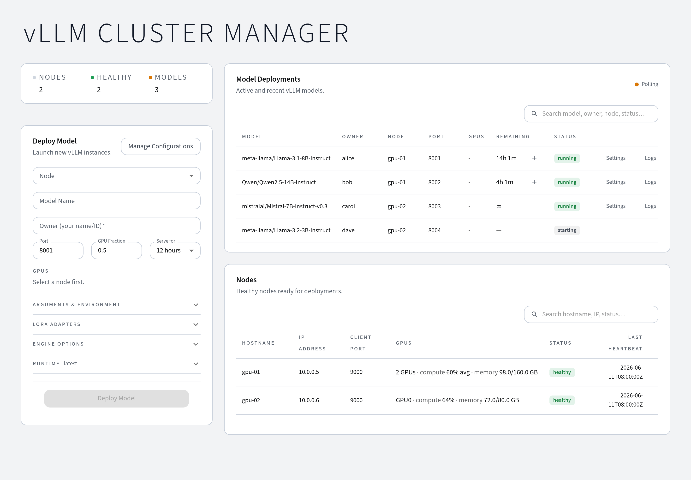
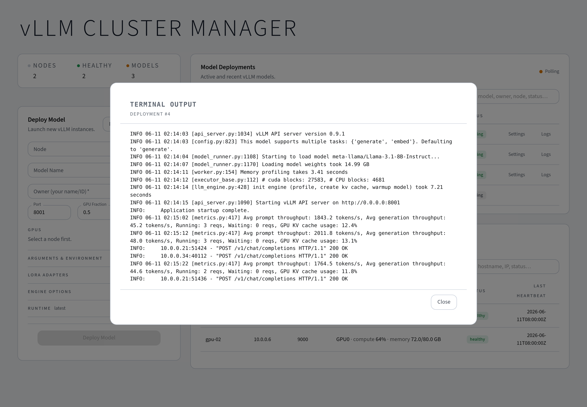
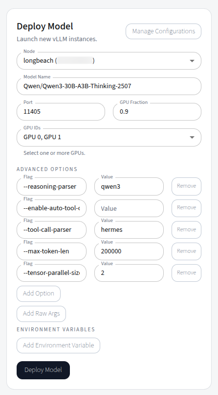

# VLLM Cluster Manager

[](https://sisl.github.io/VLLMClusterManager/)
[](https://pypi.org/project/vllm-cluster-manager/)
[](https://github.com/sisl/VLLMClusterManager/actions/workflows/tests.yml)
[](https://pypi.org/project/vllm-cluster-manager/)



Admin dashboard + satellite clients for multi-model vLLM deployments.

Use this UI to deploy vLLM `serve` endpoints across a cluster so you can stand up multiple LLM servers (same or different models) with a few clicks. It is ideal for research labs or small business environments that need repeatable, multi-endpoint deployments without building a full MLOps stack.

Deployment is as simple as running the CLI on the host and on each client, with automatic client discovery. You can run in the foreground or with `--service` to install persistent systemd services.

## Tested hardware/software
- GPUs: NVIDIA H100, NVIDIA A100, NVIDIA L40, NVIDIA DGX Spark (GB10), NVIDIA RTX 4090.
- OS: Ubuntu 22.04 and Ubuntu 24.04.

## What it can do
- Register and manage GPU nodes that run vLLM workloads.
- Create model configurations and launch models on selected nodes — HF hub models, local fine-tuned checkpoints, and LoRA adapters.
- Reach every model through one OpenAI-compatible gateway URL (`/v1`) that stays stable across node moves, or talk to nodes directly.
- Track per-deployment usage from vLLM's own metrics: lifetime tokens, request counts, and average read/generation speeds (over processing time, idle-free).
- Export a reproducibility manifest per deployment (model, HF revision, seed, vLLM version, image digest, full config) and redeploy from it.
- Get Slack/webhook notifications when deployments become ready, fail, or are about to expire — and extend running deployments without a restart.
- Monitor node health, GPU/disk metrics with history charts, and model status; put nodes into maintenance mode for servicing.
- Stream timestamped logs from running processes for quick troubleshooting, with classified failure causes and crash-loop protection; the full per-run log is persisted on the node (monitoring noise filtered out) and downloadable from the dashboard.

See the [documentation](https://sisl.github.io/VLLMClusterManager/) for full guides.

## Real-time logs
Stream logs from running nodes and model processes directly in the dashboard.



## Model configuration
Define and manage model settings (weights, runtime settings, resource usage) from the UI. Structured engine options cover the common vLLM flags (served model name, max model length, dtype, quantization, HF revision, seed, ...), with free-text extra args as an escape hatch.



## OpenAI-compatible gateway
Every deployment is reachable through a single gateway URL on the host, so client code never needs to know which node a model landed on:

```python
from openai import OpenAI

client = OpenAI(base_url="http://my-host:5173/v1", api_key="not-needed")
resp = client.chat.completions.create(
    model="meta-llama/Llama-3.1-8B-Instruct",
    messages=[{"role": "user", "content": "Hello"}],
)
```

The gateway routes by served model name (including LoRA adapter names), supports streaming, and lists everything under `GET /v1/models`. Direct `http://<node>:<port>/v1` access still works; an **Endpoint** button on each running deployment provides copy-paste URLs and code snippets with a gateway/direct toggle.

## Built for research workflows
- **Reproducibility**: pin HF revision + seed, capture the exact vLLM image digest, and export a one-click JSON manifest per deployment that can be cited and redeployed (`POST /api/deployments/from-manifest`). Secrets never leave the cluster — manifests contain env var keys only.
- **Usage accounting**: each deployment's row shows lifetime prompt/completion tokens, total requests, and average read (prefill) / generation (decode) speeds measured over actual processing time — idle never dilutes them and they stay visible between bursts; the tooltip adds engine-wide throughput and queue depth. Fed by vLLM's own Prometheus metrics, so gateway and direct traffic are both counted.
- **Notifications**: configure a Slack/webhook URL (Settings dialog or `WEBHOOK_URL` env default) to get messages when a model becomes ready, errors out (with classified cause), or is about to expire. Running deployments can be extended without a restart.
- **Live global settings**: the dashboard's Settings dialog tunes the cluster without restarts — gateway on/off + timeout, deployment start timeout, deploy-form defaults (port, GPU fraction, duration, vLLM version), notifications, metric retention, granular database purge, and sync tuning. Saved values override env defaults.
- **Local models & LoRA**: upload checkpoint folders/archives from the browser (streamed, with progress) or pull them from a URL directly onto a node — or allowlist pre-existing directories via `MODEL_DIRS`. Local checkpoints and LoRA adapters are mounted read-only and path-validated.
- **Docker or Podman per node**: each agent detects which runtimes exist; pick per node in the Manage dialog, set a cluster-wide preference in Settings, and nodes without any runtime are flagged in the node table. Rootless Podman supports clusters that disallow the Docker daemon.

## Architecture
- **Host**: Admin services for infrastructure, API, and UI.
  - **Infra**: Postgres + Consul (service discovery) via Docker Compose.
  - **Backend**: FastAPI service for orchestration and persistence.
  - **Frontend**: React + Vite admin dashboard.
- **Client**: Python agent running on GPU nodes; registers with the host and runs vLLM workloads.

## Repo layout
- `vllm_cluster_manager/cli.py` CLI entry point (`vllm-cluster-manager`)
- `vllm_cluster_manager/assets/host/` Admin services (infra, backend, frontend)
- `vllm_cluster_manager/assets/client/` Satellite node agent
- `docs/` Documentation site (MkDocs)
- `img/` Screenshots used in documentation

## Prerequisites
Host:
- Docker + Docker Compose plugin (configure the `docker` group so no sudo is required).
- Node.js + npm.
- Python 3.10–3.14.
- `uv` (Python package manager).

Client:
- NVIDIA GPU with a recent driver (`nvidia-smi` working).
- A container runtime: **Docker Engine** (add the client user to the `docker` group) **or Podman ≥ 4** with its API socket enabled (`systemctl --user enable --now podman.socket`) — useful on clusters that disallow the Docker daemon; rootless Podman works. Plus the [NVIDIA Container Toolkit](https://docs.nvidia.com/datacenter/cloud-native/container-toolkit/latest/install-guide.html) (Podman nodes additionally need CDI specs: `nvidia-ctk cdi generate`). vLLM runs in the official `vllm/vllm-openai` containers either way; the node needs no local CUDA/PyTorch toolchain.
- Python 3.10–3.14 (for the lightweight client agent).

Verify Docker can see the GPUs before installing the client:
```bash
docker run --rm --gpus all ubuntu nvidia-smi
```

Install `uv` if you don't already have it:
```bash
curl -LsSf https://astral.sh/uv/install.sh | sh
```

## Install (pip)
Create and activate a virtual environment:
```bash
uv venv
source .venv/bin/activate
```

```bash
uv pip install vllm-cluster-manager
```

## Start the host
Foreground (no sudo):
```bash
vllm-cluster-manager host up --host-ip 127.0.0.1 --host-frontend-port 5173 --host-discover-port 47528
```

`host up` builds a static frontend bundle and serves it with the Vite preview server.
The UI assumes it is served at `/` by default; if you serve it under a subpath (for example `/vllm/`), pass `--base-path /vllm/` so asset URLs and API/WebSocket paths are generated correctly.

Persistent service (systemd):
```bash
vllm-cluster-manager host up --service --host-ip 127.0.0.1 --host-frontend-port 5173 --host-discover-port 47528
```

`--host-discover-port` sets the discovery port used for clients. Use `--host-backend-port` to override the backend API port (default 8000).

Stop host services (foreground or systemd):
```bash
vllm-cluster-manager host down
```

## Start a client
Foreground (no sudo):
```bash
vllm-cluster-manager client up --host-ip 127.0.0.1 --host-discover-port 47528
```

Persistent service (systemd):
```bash
vllm-cluster-manager client up --service --host-ip 127.0.0.1 --host-discover-port 47528
```

Stop client services (foreground or systemd):
```bash
vllm-cluster-manager client down
```

## CLI flags
**Host (`host up`)**

| Flag | Default | Description |
| --- | --- | --- |
| `--service` | `false` | Run as a persistent systemd service. |
| `--host-ip` | `127.0.0.1` | Bind host for the backend API and UI backend target. |
| `--host-frontend-port` | `5173` | UI port. |
| `--host-discover-port` | `47528` | Discovery port used by clients. |
| `--host-backend-port` | `8000` | Backend API port. |
| `--base-path` | `/` | Base path for the UI (reverse proxy subpath). |
| `--postgres-host` | `127.0.0.1` | Postgres host. |
| `--postgres-port` | `5757` | Postgres port. |
| `--postgres-db` | `vllm_admin` | Postgres database name. |
| `--postgres-user` | `vllm` | Postgres user. |
| `--postgres-password` | `change-me` | Postgres password. |

**Client (`client up`)**

| Flag | Default | Description |
| --- | --- | --- |
| `--service` | `false` | Run as a persistent systemd service. |
| `--host-ip` | `127.0.0.1` | Host IP for discovery. |
| `--host-discover-port` | `47528` | Host discovery port. |
| `--client-host` | `0.0.0.0` | Client bind host. |
| `--client-port` | `9000` | Client bind port. |
| `--node-name` | `<hostname>` | Node name used for registration. |

**Down commands**
- `host down` and `client down` stop foreground processes and remove/stop systemd services if present.

## Configuration files
The CLI writes service-specific env files under `~/.local/share/vllm_cluster_manager`:
- `host/.env` (Docker compose: Postgres + discovery service)
- `host/backend/.env` (API service)
- `host/frontend/.env` (UI)
- `client/.env` (client agent)

If you edit any env file, restart the affected service.

Notable settings: `WEBHOOK_URL` (backend — enables Slack/webhook notifications), `MODEL_DIRS` (client — allowlists directories for local checkpoints/LoRA adapters), `MAX_FAILED_RESTARTS` (client — crash-loop breaker, default 3). See the [Operations docs](https://sisl.github.io/VLLMClusterManager/operations/) for the full reference.

## Gated models (Hugging Face)
Some models (for example Llama variants) require a Hugging Face access token. Provide the token via an env var when creating the deployment:
- `HF_TOKEN`
- `HUGGING_FACE_HUB_TOKEN`

Set the value to your Hugging Face access token (read access) and include quotation marks, for example:
```
HUGGING_FACE_HUB_TOKEN="hf_..."
```

You can add this in the UI under env vars or by setting it in the client environment before starting a deployment.

## Firewall rules
Allow these network paths (adjust ports to your flags):
- User → Host UI: TCP `host-frontend-port` (default 5173).
- UI/Browser → Host API: TCP `host-backend-port` (default 8000).
- Clients → Host discovery port: TCP `host-discover-port` (default 47528).
- Host → Client agents: TCP `client-port` (default 9000).
- Gateway API consumers → Host: TCP `host-frontend-port` or `host-backend-port` (the OpenAI gateway at `/v1`).
- Direct API consumers → Client nodes: TCP on each deployment's port (only if bypassing the gateway).

## Data persistence
Host data (deployments, nodes, metric history, saved configurations) lives in a named Postgres Docker volume and persists across `host down`, systemd restarts, and reboots — deployments come back with their owner, remaining time, and launch configuration intact. To wipe intentionally: `host down --purge`, `clean`, or the dashboard's Settings → Purge database (running models are re-adopted automatically from a launch manifest stored on each container).

## Quick start (dev)
1) Start infrastructure:

```bash
cd vllm_cluster_manager/assets/host
cp .env.example .env
# edit .env for passwords

docker compose up -d
```

2) Backend (venv recommended):

```bash
cd vllm_cluster_manager/assets/host/backend
python -m venv .venv
. .venv/bin/activate
pip install -r requirements.txt
uvicorn app.main:app --reload
```

3) Frontend:

```bash
cd vllm_cluster_manager/assets/host/frontend
npm install
npm run dev
```

Open the UI at `http://localhost:5173` by default (see `vllm_cluster_manager/assets/host/frontend/.env`).

## Notes
- The service registry is Consul (used for client discovery).
- WebSocket log streaming is handled in `host/frontend/src/services/ws.ts`.
