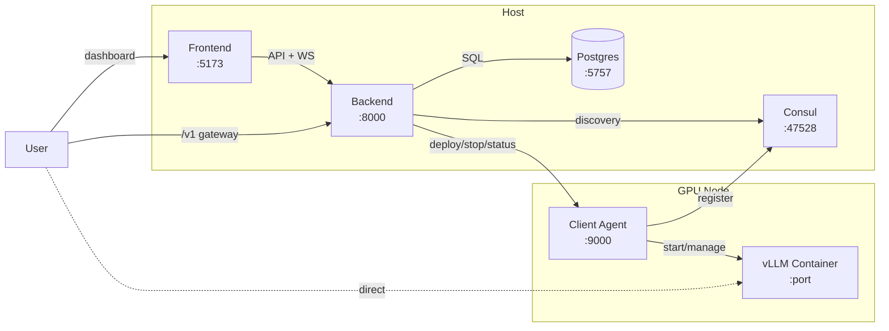
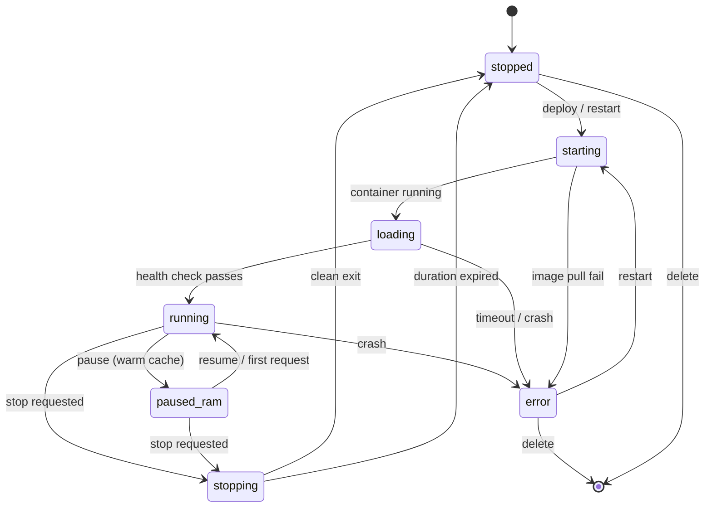

# Architecture

## Overview
Aquila runs three host services and a client agent on each GPU node.

  

    <strong>Host services</strong>
    <ul>
      <li>Infra: Postgres + Consul via Docker Compose</li>
      <li>Backend: FastAPI orchestration API</li>
      <li>Frontend: React + Vite admin dashboard</li>
    </ul>
  

  

    <strong>Client agent</strong>
    <ul>
      <li>Python service that registers with Consul</li>
      <li>Runs each deployment as an official <code>vllm/vllm-openai</code> Docker container</li>
      <li>Pulls/builds and caches images; reconciles running containers on restart</li>
      <li>Reports deployment status, version, and GPU metrics</li>
    </ul>
  

## Service discovery
Consul provides service discovery so the UI and backend can list connected clients.

## Data flow
1. Client registers with Consul.
2. Backend discovers clients and stores state in Postgres.
3. UI calls the backend API and subscribes to WebSocket streams for logs and status.
4. On deploy, the backend proxies the request to the client, which pulls the matching `vllm/vllm-openai` image (building a derived image if extra packages are requested) and starts a vLLM container.
5. The sync loop periodically polls clients for deployment status and GPU metrics, updating the database. If the backend restarts, it rediscovers running deployments from clients automatically.

## Ports
| Service | Default | Purpose |
| --- | --- | --- |
| Frontend | 5173 | Web UI (Vite dev server). |
| Backend | 8000 | API + WebSockets. |
| Consul | 47528 | Host port mapped to Consul HTTP API (container port 8500). |
| Postgres | 5757 | Host port mapped to Postgres (container port 5432). |
| Client | 9000 | Client agent HTTP server. |

## Communication flow

## Deployment lifecycle

A deployment moves through these states:

## WebSocket events

The backend pushes live updates to the frontend over a single WebSocket connection (`/ws`). The frontend reconnects automatically on disconnect. Message format:

| Event type | Trigger | Payload |
| --- | --- | --- |
| `deployments_changed` | Any deployment status change, create, delete, or settings update | `{"type": "deployments_changed"}` |
| `nodes_changed` | Node status, metrics, or configuration update | `{"type": "nodes_changed"}` |
| `settings_changed` | Runtime settings updated via the Settings dialog | `{"type": "settings_changed"}` |
| `api_keys_changed` | API key created, updated, or deleted | `{"type": "api_keys_changed"}` |

The frontend uses these events to invalidate its React Query caches and re-fetch the affected data, keeping the dashboard in sync across multiple browser tabs without polling.
