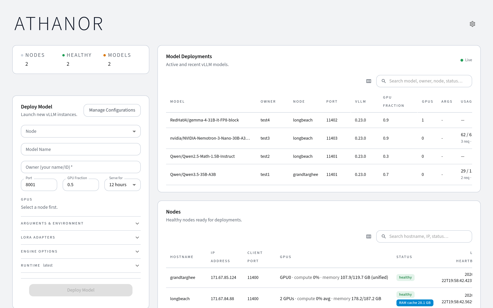

  
  GPU Inference Management

  <h2>Deploy, serve, and manage LLMs across your GPU cluster</h2>
  
Aquila gives you a single control plane for multi-node vLLM inference. Point-and-click deployments, an OpenAI-compatible gateway with API key auth, warm caching that parks idle models in RAM, live GPU monitoring, and a full deployment lifecycle — without Kubernetes or a managed platform.

  

    

      <strong>Best for</strong>
      <ul>
        <li>Research labs and university clusters</li>
        <li>Teams sharing GPUs across projects</li>
        <li>Self-hosted multi-model inference</li>
      </ul>
    

    

      <strong>Built-in</strong>
      <ul>
        <li>OpenAI-compatible gateway & API keys</li>
        <li>Warm cache (GPU ↔ RAM offloading)</li>
        <li>LoRA, checkpoints, and version pinning</li>
      </ul>
    

  

  

## What you can do
- Register and manage GPU nodes that run vLLM workloads — via Docker or rootless Podman, selectable per node.
- Deploy models with a specific vLLM version, nightly build, or commit hash — each runs in the matching official `vllm/vllm-openai` container.
- Serve Hugging Face hub models, local fine-tuned checkpoints, and LoRA adapters — upload checkpoints from the browser (streamed) or pull them from a URL directly onto a node.
- Reach every model through one [OpenAI-compatible gateway URL](gateway.md) that is stable across node moves — or talk to nodes directly.
- Track per-deployment usage from vLLM's own metrics: lifetime tokens, request counts, and average read (prefill) / generation speeds measured over actual processing time — idle phases never dilute them.
- Export a reproducibility manifest per deployment (model, HF revision, seed, vLLM version, image digest, full config) and redeploy from it.
- Get Slack/webhook notifications when deployments become ready, fail, or are about to expire — and extend running deployments without a restart.
- Install extra pip packages and upload vLLM plugins (`.py`, `.whl`) per deployment.
- Select GPUs with toggle buttons and configure tensor parallelism.
- Save and reload deployment configurations for one-click redeployment.
- Tune the cluster live from the Settings dialog: gateway on/off, timeouts, notification webhook, deploy-form defaults, data retention, and granular purge — no restarts.
- Monitor node health, GPU utilization, disk usage, and deployment status in real time, with 48-hour metric history charts.
- Put nodes into maintenance mode (optionally draining their deployments) for safe servicing.
- Stream timestamped logs from running processes — the full per-run log is persisted on the node (monitoring noise filtered) and downloadable — with classified failure causes and crash-loop protection.
- Pause idle models to RAM and resume them on demand — the **warm cache** frees GPU VRAM while keeping weights ready for near-instant restart, with LRU auto-eviction, busy guards, and per-deployment pinning.
- Protect the gateway with **API keys** — permanent keys with optional per-deployment scoping, plus auto-expiring snippet keys for the Endpoint dialog.
- Cordon individual GPUs for **per-GPU maintenance** — partial maintenance excludes specific GPUs from new deployments while the rest of the node keeps serving.
- Automatic deployment recovery after backend restarts; schema migrations run automatically on upgrade.

## Supported platforms
- Python 3.10–3.14, Node.js ≥ 23 (host only)
- Ubuntu 22.04 and 24.04
- NVIDIA GPUs (H100, A100, L40, RTX 4090, DGX Spark)

!!! tip
    New here? Start with the [Getting Started](getting-started.md) guide, then review the [Deployments](deployments.md) page for version selection and configuration options.
